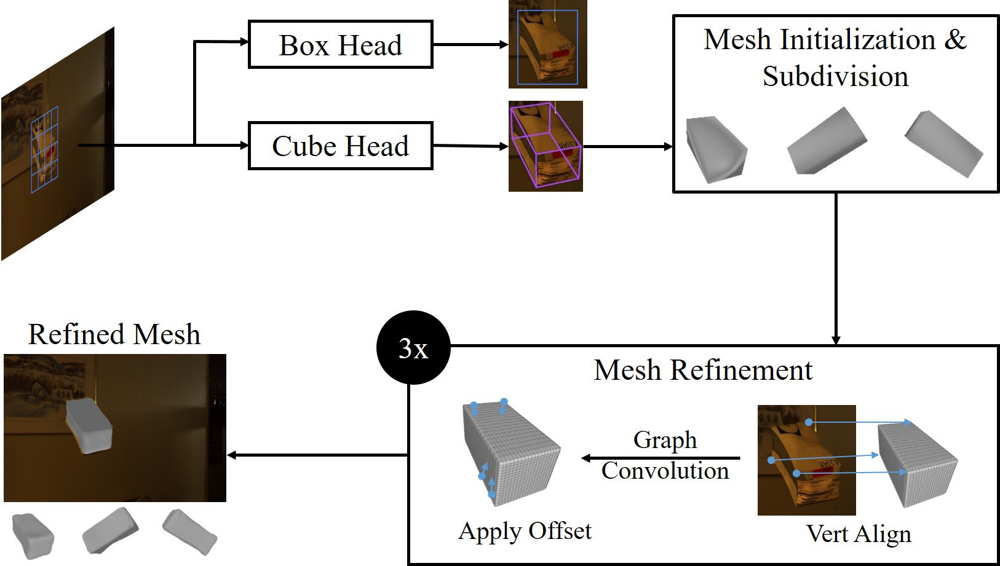
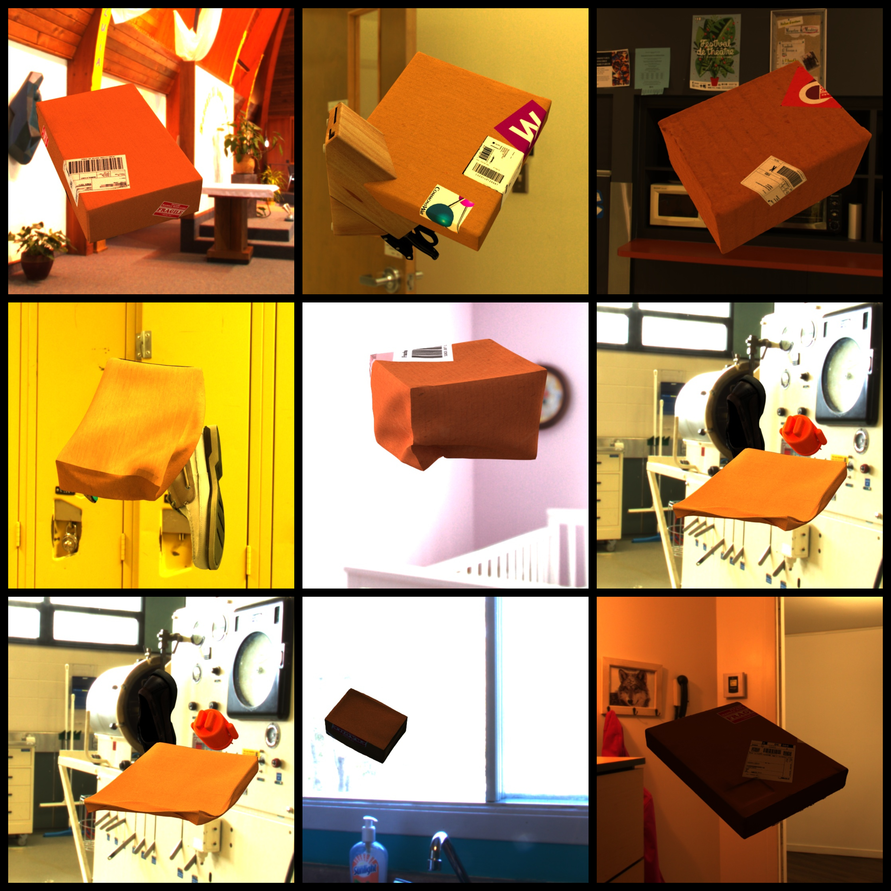

[](https://openaccess.thecvf.com/content/CVPR2023W/VISION/html/Naumann_Parcel3D_Shape_Reconstruction_From_Single_RGB_Images_for_Applications_in_CVPRW_2023_paper.html)
[](https://a-nau.github.io/parcel3d)

# CubeRefine R-CNN

This repo was developed as part of our CVPRW '23 [paper](https://openaccess.thecvf.com/content/CVPR2023W/VISION/html/Naumann_Parcel3D_Shape_Reconstruction_From_Single_RGB_Images_for_Applications_in_CVPRW_2023_paper.html) *Parcel3D: Shape Reconstruction From Single RGB Images for Applications in Transportation Logistics* ([citation](#citation)), also check
the [project page](https://a-nau.github.io/parcel3d/) for more details.

<p align="center">
    
    <br>
    <span style="font-size: small">
      <b>Figure:</b> 
      We take an RGB image as input and use Cube R-CNN's Cube Head to estimate a 3D bounding box. This bounding box is subdivided and serves as initial mesh, which is refined by an iterative mesh refinement. For training and evaluation we present Parcel3D, a novel dataset of normal and damaged parcels with full 3D annotations. 
      (c) IEEE 2023.
    </span>
    <br>
</p>


## Usage

We highly recommend to use the provided Devcontainer to make the usage as easy as possible:

- Install [Docker](https://www.docker.com/) and [VS Code](https://code.visualstudio.com/)
- Install VS Code Devcontainer extension `ms-vscode-remote.remote-containers`
- Clone the repository
  ```shell
  git clone https://github.com/a-nau/cuberefine-r-cnn.git
  ```
- Press `F1` (or `CTRL + SHIFT + P`) and select `Dev Containers: Rebuild and Reopen Container`
- Go to `Run and Debug (CTRL + SHIFT + D)` and press the run button, alternatively press `F5`

Alternatively, make sure to use CUDA 11.3 (see [this repo](https://github.com/a-nau/python-cuda-envs/) if you use multiple CUDA versions) and Torch 1.11 and install the following

```shell
# General
pip install scikit-image==0.18.* matplotlib imageio==2.31.1 opencv-python==4.8.0.74 scipy==1.10.1 pandas==2.0.3 joblib==1.3.1 einops==0.6.1
# Detectron2
pip install "git+https://github.com/facebookresearch/detectron2.git@v0.6"
# Pytorch3D
pip install fvcore==0.1.5.post20221221 
pip install --no-index --no-cache-dir pytorch3d -f https://dl.fbaipublicfiles.com/pytorch3d/packaging/wheels/py38_cu113_pyt1110/download.html
# PyTorch Geometric
pip install pyg_lib==0.2.0 torch_scatter==2.0.9 torch_sparse==0.6.13 torch_cluster==1.6.0 torch_spline_conv==1.2.1 -f https://data.pyg.org/whl/torch-1.11.0+cu113.html
pip install torch_geometric==2.3.1
```

and run

```shell
python tools/train_parcel3d.py --config-file configs/Base_Parcel3D.yaml --num-gpus 1
```

### Pre-trained Weights

You can download the pre-trained weights [here](https://drive.google.com/drive/folders/1sCNRldkVpJ_jSUpUJmdDNidNL8kC_hfR?usp=sharing)

- `cubercnn_box.pth`: Cube R-CNN checkpoint with only output class `box`
- `parcel3d.pth`: CubeRefine R-CNN checkpoint pre-trained on [Parcel3d](#parcel3d-dataset)

## Parcel3D Dataset

You can download the Parcel3D dataset [here](https://zenodo.org/record/8032204). 

<p align="center">
    
    <br>
    <span style="font-size: small">
      <b>Figure:</b> 
        Visual samples from Parcel3D.
        Check our <a href="https://a-nau.github.io/parcel3d/">project website</a> for more.
    </span>
    <br>
</p>

Note that you need to use the `json` files from the `misc/omni3d_json` folder

## Citation

If you use this code for scientific research, please consider citing the following works.

### Parcel3D: Shape Reconstruction From Single RGB Images for Applications in Transportation Logistics

Our work for which this repository was developed.

```latex
@inproceedings{naumannParcel3DShapeReconstruction2023,
    author    = {Naumann, Alexander and Hertlein, Felix and D\"orr, Laura and Furmans, Kai},
    title     = {Parcel3D: Shape Reconstruction From Single RGB Images for Applications in Transportation Logistics},
    booktitle = {Proceedings of the IEEE/CVF Conference on Computer Vision and Pattern Recognition (CVPR) Workshops},
    month     = {June},
    year      = {2023},
    pages     = {4402-4412}
	address   = {Vancouver, Canada},
}
```

### Omni3D: A Large Benchmark and Model for 3D Object Detection in the Wild

The work of Brazil et al. from which this code is heavily borrowed

```latex
@inproceedings{brazil2023omni3d,
	title        = {{Omni3D}: A Large Benchmark and Model for {3D} Object Detection in the Wild},
	author       = {Garrick Brazil and Abhinav Kumar and Julian Straub and Nikhila Ravi and Justin Johnson and Georgia Gkioxari},
	year         = 2023,
	month        = {June},
	booktitle    = {CVPR},
	address      = {Vancouver, Canada},
	organization = {IEEE}
}
```

### Mesh R-CNN

The work of Gkioxari et al. from which some code is borrowed

```latex
@inproceedings{Gkioxari_2019_ICCV,
	title        = {Mesh R-CNN},
	author       = {Gkioxari, Georgia and Malik, Jitendra and Johnson, Justin},
	year         = 2019,
	month        = {October},
	booktitle    = {Proceedings of the IEEE/CVF International Conference on Computer Vision (ICCV)}
}
```

## Affiliations

<p align="center">
    
</p>


## License

This is a modified version of [Cube R-CNN](https://github.com/facebookresearch/omni3d/), which is released under [CC-BY-NC 4.0](LICENSE).
It also borrows part of the code from [Mesh R-CNN](https://github.com/facebookresearch/meshrcnn), which is released under [BSD-3-Clause License](LICENSE).

Unless otherwise stated, this repo is distributed under  [CC-BY-NC 4.0](LICENSE).